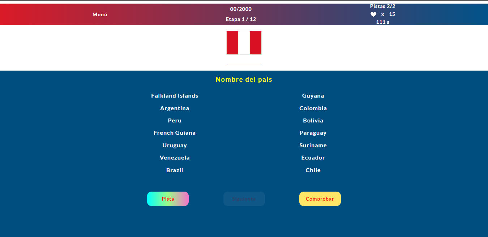
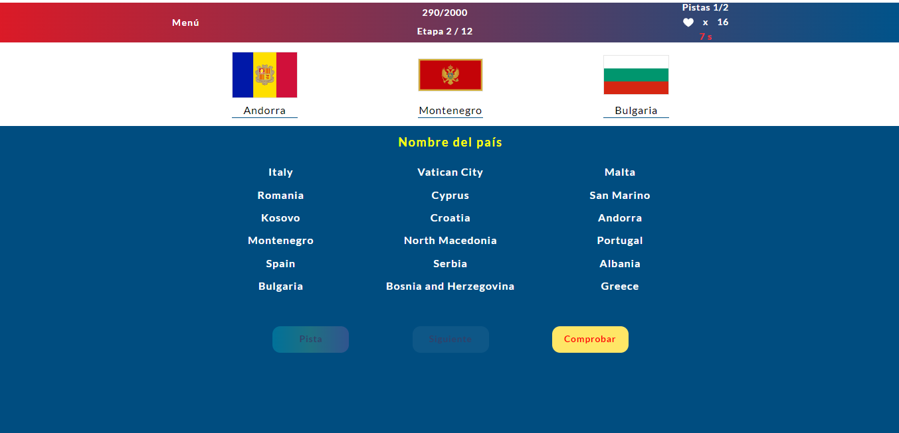
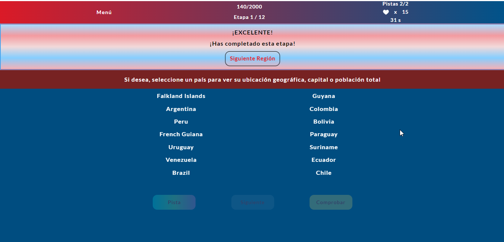

# Banderas, países y regiones
### Descripción
Aplicación web **interactiva** y **didáctica** donde pondrá a prueba su conocimiento sobre las banderas de los países. Está dividida en regiones y consta de **tiempo** y **chances** limitados, de esta manera es más interesante el desafío.
### Como se ve

### Como usar
[Click aquí para iniciar](https://enmanuel-otero-montano.github.io/Juego-de-Banderas/ "Inicio")
### Tecnologías utilizadas
- **HTML**
- **CSS**
- **JavaScript**
- **EsLint**
- **REST Countries API**
### Actualizaciones futuras
- Tabla de estadísticas
- Postear resultados en Redes Sociales
- Agregar países faltantes
#### Autor
**Enmanuel Otero Montano**

[Twitter](https://twitter.com/Enmanue78366929/ "twitter")

[Linkedin](https://www.linkedin.com/in/enmanuel-otero-montano// "linkedin")
